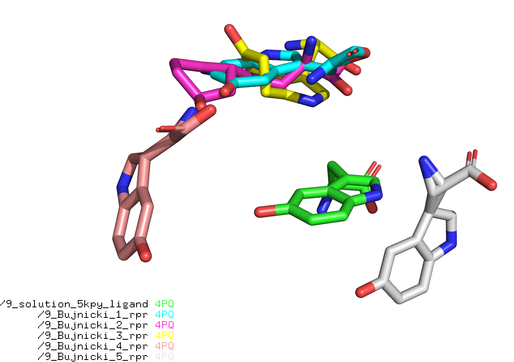

RNA-Puzzle 09
-----------------------------------------------------------------------------

5-hydroxytryptophan aptamer

Bujnicki group submitted models with the ligand. The models can be found in `/with_ligand/`.

Issues:

- Missing Bujnicki 1 & 2 files

Changes:

- 9_0_solution_5kpy_rpr.pdb starts from 1 to 71 now. The natives goes from 13-83.

RMSD:

    rna_calc_rmsd.py -t 9_0_solution_5kpy_rpr.pdb *.pdb
    method: all-atom-built-in
    # of models: 35
    9_0_solution_5kpy_rpr.pdb 0.0 1513
    9_Bujnicki_3_rpr.pdb 6.18 1513
    9_Bujnicki_4_rpr.pdb 6.18 1513
    9_Bujnicki_5_rpr.pdb 6.18 1513
    9_Chen_1_rpr.pdb 6.5 1513
    9_Chen_2_rpr.pdb 6.39 1513
    9_Chen_3_rpr.pdb 6.38 1513
    9_Chen_4_rpr.pdb 6.47 1513
    9_Chen_5_rpr.pdb 6.39 1513
    9_Chen_6_rpr.pdb 6.59 1513
    9_Chen_7_rpr.pdb 6.04 1513
    9_Chen_8_rpr.pdb 6.49 1513
    9_Das_1_rpr.pdb 8.67 1513
    9_Das_2_rpr.pdb 7.76 1513
    9_Das_3_rpr.pdb 8.35 1513
    9_Das_4_rpr.pdb 9.5 1513
    9_Das_5_rpr.pdb 7.79 1513
    9_Das_6_rpr.pdb 8.61 1513
    9_Das_7_rpr.pdb 8.94 1513
    9_Das_8_rpr.pdb 10.52 1513
    9_Das_9_rpr.pdb 9.78 1513
    9_Ding_1_rpr.pdb 9.59 1513
    9_Ding_2_rpr.pdb 9.79 1513
    9_Ding_3_rpr.pdb 8.98 1513
    9_Ding_4_rpr.pdb 9.82 1513
    9_Ding_5_rpr.pdb 8.93 1513
    9_Ding_6_rpr.pdb 12.07 1513
    9_Ding_7_rpr.pdb 9.58 1513
    9_Ding_8_rpr.pdb 11.11 1513
    9_Ding_9_rpr.pdb 9.91 1513
    9_Ding_10_rpr.pdb 11.14 1513
    9_Dokholyan_1_rpr.pdb 20.16 1513
    9_Dokholyan_2_rpr.pdb 25.43 1513
    9_Dokholyan_3_rpr.pdb 22.35 1513
    9_Dokholyan_4_rpr.pdb 19.35 1513
    # of atoms used: 1513
    csv was created!  rmsds.csv

INFs:

    rp09$ git:(master) ✗ rna_calc_inf.py  -t 9_0_solution_5kpy_rpr.pdb *.pdb
    100% (35 of 35) |#################################################################################################################################| Elapsed Time: 0:02:54 ETA:  00:00:00csv was created!  inf.csv
    (base) [mm] rp09$ git:(master) ✗ csv inf.csv
    target                           fn                               inf_all  inf_stack  inf_WC  inf_nWC  sns_WC  ppv_WC  sns_nWC  ppv_nWC
    9_0_solution_5kpy_rpr.pdb.outCR  9_0_solution_5kpy_rpr.pdb.outCR  1.000    1.000      1.000   1.000    1.000   1.000   1.000    1.000
    9_0_solution_5kpy_rpr.pdb.outCR  9_Bujnicki_3_rpr.pdb.outCR       0.432    0.125      0.837   0.583    0.700   1.000   0.583    0.583
    9_0_solution_5kpy_rpr.pdb.outCR  9_Bujnicki_5_rpr.pdb.outCR       0.728    0.719      0.837   0.641    0.700   1.000   0.667    0.615
    9_0_solution_5kpy_rpr.pdb.outCR  9_Chen_3_rpr.pdb.outCR           0.755    0.714      0.922   0.714    0.850   1.000   0.583    0.875
    9_0_solution_5kpy_rpr.pdb.outCR  9_Bujnicki_4_rpr.pdb.outCR       0.432    0.125      0.837   0.583    0.700   1.000   0.583    0.583
    9_0_solution_5kpy_rpr.pdb.outCR  9_Chen_1_rpr.pdb.outCR           0.469    0.000      0.922   0.612    0.850   1.000   0.500    0.750
    9_0_solution_5kpy_rpr.pdb.outCR  9_Chen_4_rpr.pdb.outCR           0.460    0.000      0.922   0.577    0.850   1.000   0.500    0.667
    9_0_solution_5kpy_rpr.pdb.outCR  9_Chen_2_rpr.pdb.outCR           0.469    0.000      0.922   0.612    0.850   1.000   0.500    0.750
    9_0_solution_5kpy_rpr.pdb.outCR  9_Chen_5_rpr.pdb.outCR           0.479    0.000      0.922   0.655    0.850   1.000   0.500    0.857
    9_0_solution_5kpy_rpr.pdb.outCR  9_Chen_6_rpr.pdb.outCR           0.720    0.700      0.843   0.612    0.800   0.889   0.500    0.750
    9_0_solution_5kpy_rpr.pdb.outCR  9_Chen_7_rpr.pdb.outCR           0.468    0.000      0.922   0.577    0.850   1.000   0.333    1.000
    9_0_solution_5kpy_rpr.pdb.outCR  9_Das_1_rpr.pdb.outCR            0.779    0.742      0.949   0.696    0.900   1.000   0.667    0.727
    9_0_solution_5kpy_rpr.pdb.outCR  9_Das_4_rpr.pdb.outCR            0.790    0.765      0.949   0.667    0.900   1.000   0.667    0.667
    9_0_solution_5kpy_rpr.pdb.outCR  9_Das_2_rpr.pdb.outCR            0.455    0.000      0.872   0.639    0.850   0.895   0.583    0.700
    9_0_solution_5kpy_rpr.pdb.outCR  9_Chen_8_rpr.pdb.outCR           0.447    0.000      0.866   0.612    0.750   1.000   0.500    0.750
    9_0_solution_5kpy_rpr.pdb.outCR  9_Das_5_rpr.pdb.outCR            0.482    0.000      0.896   0.730    0.850   0.944   0.667    0.800
    9_0_solution_5kpy_rpr.pdb.outCR  9_Das_3_rpr.pdb.outCR            0.438    0.125      0.896   0.522    0.850   0.944   0.583    0.467
    9_0_solution_5kpy_rpr.pdb.outCR  9_Das_6_rpr.pdb.outCR            0.484    0.125      0.896   0.696    0.850   0.944   0.667    0.727
    9_0_solution_5kpy_rpr.pdb.outCR  9_Das_7_rpr.pdb.outCR            0.740    0.726      0.922   0.522    0.850   1.000   0.500    0.545
    9_0_solution_5kpy_rpr.pdb.outCR  9_Ding_10_rpr.pdb.outCR          0.674    0.661      0.878   0.204    0.900   0.857   0.083    0.500
    9_0_solution_5kpy_rpr.pdb.outCR  9_Das_8_rpr.pdb.outCR            0.471    0.000      0.922   0.639    0.850   1.000   0.583    0.700
    9_0_solution_5kpy_rpr.pdb.outCR  9_Ding_3_rpr.pdb.outCR           0.709    0.697      0.906   0.289    0.950   0.864   0.083    1.000
    9_0_solution_5kpy_rpr.pdb.outCR  9_Ding_1_rpr.pdb.outCR           0.417    0.000      0.886   0.289    0.950   0.826   0.083    1.000
    9_0_solution_5kpy_rpr.pdb.outCR  9_Ding_4_rpr.pdb.outCR           0.396    0.000      0.858   0.204    0.900   0.818   0.083    0.500
    9_0_solution_5kpy_rpr.pdb.outCR  9_Das_9_rpr.pdb.outCR            0.458    0.000      0.922   0.617    0.850   1.000   0.667    0.571
    9_0_solution_5kpy_rpr.pdb.outCR  9_Ding_5_rpr.pdb.outCR           0.408    0.000      0.867   0.289    0.950   0.792   0.083    1.000
    9_0_solution_5kpy_rpr.pdb.outCR  9_Ding_2_rpr.pdb.outCR           0.408    0.000      0.886   0.204    0.950   0.826   0.083    0.500
    9_0_solution_5kpy_rpr.pdb.outCR  9_Ding_6_rpr.pdb.outCR           0.657    0.635      0.900   0.000    0.900   0.900   0.000    0.000
    9_0_solution_5kpy_rpr.pdb.outCR  9_Dokholyan_3_rpr.pdb.outCR      0.581    0.559      0.810   0.000    0.850   0.773   0.000    0.000
    9_0_solution_5kpy_rpr.pdb.outCR  9_Ding_7_rpr.pdb.outCR           0.411    0.000      0.896   0.204    0.850   0.944   0.083    0.500
    9_0_solution_5kpy_rpr.pdb.outCR  9_Ding_9_rpr.pdb.outCR           0.696    0.702      0.878   0.167    0.900   0.857   0.083    0.333
    9_0_solution_5kpy_rpr.pdb.outCR  9_Dokholyan_4_rpr.pdb.outCR      0.341    0.000      0.781   0.000    0.800   0.762   0.000    0.000
    9_0_solution_5kpy_rpr.pdb.outCR  9_Dokholyan_1_rpr.pdb.outCR      0.348    0.000      0.800   0.000    0.800   0.800   0.000    0.000
    9_0_solution_5kpy_rpr.pdb.outCR  9_Ding_8_rpr.pdb.outCR           0.408    0.000      0.858   0.333    0.900   0.818   0.167    0.667
    9_0_solution_5kpy_rpr.pdb.outCR  9_Dokholyan_2_rpr.pdb.outCR      0.365    0.000      0.800   0.000    0.800   0.800   0.000    0.000

Ligand
-------------------------------------------------------------------------------

See `with_ligand/only-ligand` for the files:

    rna_calc_rmsd.py -t 9_solution_5kpy_ligand_BujnickiAtomOrder.pdb 9_Buj*
    method: all-atom-built-in
    # of models: 5
    9_Bujnicki_1_rpr.pdb 2.74 16
    9_Bujnicki_2_rpr.pdb 3.2 16
    9_Bujnicki_3_rpr.pdb 2.76 16
    9_Bujnicki_4_rpr.pdb 2.79 16
    9_Bujnicki_5_rpr.pdb 2.68 16
    # of atoms used: 16
    csv was created!  rmsds.csv

Sequences:
-------------------------------------------------------------------------------

    rna_pdb_toolsx.py --get-seq *.pdb
    # 9_0_solution_5kpy_rpr
    > A:1-71
    GGACACUGAUGAUCGCGUGGAUAUGGCACGCAUUGAAUUGUUGGACACCGUAAAUGUCCUAACACGUGUCC
    # 9_Bujnicki_3_rpr
    > A:1-71
    GGACACUGAUGAUCGCGUGGAUAUGGCACGCAUUGAAUUGUUGGACACCGUAAAUGUCCUAACACGUGUCC
    # 9_Bujnicki_4_rpr
    > A:1-71
    GGACACUGAUGAUCGCGUGGAUAUGGCACGCAUUGAAUUGUUGGACACCGUAAAUGUCCUAACACGUGUCC
    # 9_Bujnicki_5_rpr
    > A:1-71
    GGACACUGAUGAUCGCGUGGAUAUGGCACGCAUUGAAUUGUUGGACACCGUAAAUGUCCUAACACGUGUCC
    # 9_Chen_1_rpr
    > A:1-71
    GGACACUGAUGAUCGCGUGGAUAUGGCACGCAUUGAAUUGUUGGACACCGUAAAUGUCCUAACACGUGUCC
    # 9_Chen_2_rpr
    > A:1-71
    GGACACUGAUGAUCGCGUGGAUAUGGCACGCAUUGAAUUGUUGGACACCGUAAAUGUCCUAACACGUGUCC
    # 9_Chen_3_rpr
    > A:1-71
    GGACACUGAUGAUCGCGUGGAUAUGGCACGCAUUGAAUUGUUGGACACCGUAAAUGUCCUAACACGUGUCC
    # 9_Chen_4_rpr
    > A:1-71
    GGACACUGAUGAUCGCGUGGAUAUGGCACGCAUUGAAUUGUUGGACACCGUAAAUGUCCUAACACGUGUCC
    # 9_Chen_5_rpr
    > A:1-71
    GGACACUGAUGAUCGCGUGGAUAUGGCACGCAUUGAAUUGUUGGACACCGUAAAUGUCCUAACACGUGUCC
    # 9_Chen_6_rpr
    > A:1-71
    GGACACUGAUGAUCGCGUGGAUAUGGCACGCAUUGAAUUGUUGGACACCGUAAAUGUCCUAACACGUGUCC
    # 9_Chen_7_rpr
    > A:1-71
    GGACACUGAUGAUCGCGUGGAUAUGGCACGCAUUGAAUUGUUGGACACCGUAAAUGUCCUAACACGUGUCC
    # 9_Chen_8_rpr
    > A:1-71
    GGACACUGAUGAUCGCGUGGAUAUGGCACGCAUUGAAUUGUUGGACACCGUAAAUGUCCUAACACGUGUCC
    # 9_Das_1_rpr
    > A:1-71
    GGACACUGAUGAUCGCGUGGAUAUGGCACGCAUUGAAUUGUUGGACACCGUAAAUGUCCUAACACGUGUCC
    # 9_Das_2_rpr
    > A:1-71
    GGACACUGAUGAUCGCGUGGAUAUGGCACGCAUUGAAUUGUUGGACACCGUAAAUGUCCUAACACGUGUCC
    # 9_Das_3_rpr
    > A:1-71
    GGACACUGAUGAUCGCGUGGAUAUGGCACGCAUUGAAUUGUUGGACACCGUAAAUGUCCUAACACGUGUCC
    # 9_Das_4_rpr
    > A:1-71
    GGACACUGAUGAUCGCGUGGAUAUGGCACGCAUUGAAUUGUUGGACACCGUAAAUGUCCUAACACGUGUCC
    # 9_Das_5_rpr
    > A:1-71
    GGACACUGAUGAUCGCGUGGAUAUGGCACGCAUUGAAUUGUUGGACACCGUAAAUGUCCUAACACGUGUCC
    # 9_Das_6_rpr
    > A:1-71
    GGACACUGAUGAUCGCGUGGAUAUGGCACGCAUUGAAUUGUUGGACACCGUAAAUGUCCUAACACGUGUCC
    # 9_Das_7_rpr
    > A:1-71
    GGACACUGAUGAUCGCGUGGAUAUGGCACGCAUUGAAUUGUUGGACACCGUAAAUGUCCUAACACGUGUCC
    # 9_Das_8_rpr
    > A:1-71
    GGACACUGAUGAUCGCGUGGAUAUGGCACGCAUUGAAUUGUUGGACACCGUAAAUGUCCUAACACGUGUCC
    # 9_Das_9_rpr
    > A:1-71
    GGACACUGAUGAUCGCGUGGAUAUGGCACGCAUUGAAUUGUUGGACACCGUAAAUGUCCUAACACGUGUCC
    # 9_Ding_10_rpr
    > A:1-71
    GGACACUGAUGAUCGCGUGGAUAUGGCACGCAUUGAAUUGUUGGACACCGUAAAUGUCCUAACACGUGUCC
    # 9_Ding_1_rpr
    > A:1-71
    GGACACUGAUGAUCGCGUGGAUAUGGCACGCAUUGAAUUGUUGGACACCGUAAAUGUCCUAACACGUGUCC
    # 9_Ding_2_rpr
    > A:1-71
    GGACACUGAUGAUCGCGUGGAUAUGGCACGCAUUGAAUUGUUGGACACCGUAAAUGUCCUAACACGUGUCC
    # 9_Ding_3_rpr
    > A:1-71
    GGACACUGAUGAUCGCGUGGAUAUGGCACGCAUUGAAUUGUUGGACACCGUAAAUGUCCUAACACGUGUCC
    # 9_Ding_4_rpr
    > A:1-71
    GGACACUGAUGAUCGCGUGGAUAUGGCACGCAUUGAAUUGUUGGACACCGUAAAUGUCCUAACACGUGUCC
    # 9_Ding_5_rpr
    > A:1-71
    GGACACUGAUGAUCGCGUGGAUAUGGCACGCAUUGAAUUGUUGGACACCGUAAAUGUCCUAACACGUGUCC
    # 9_Ding_6_rpr
    > A:1-71
    GGACACUGAUGAUCGCGUGGAUAUGGCACGCAUUGAAUUGUUGGACACCGUAAAUGUCCUAACACGUGUCC
    # 9_Ding_7_rpr
    > A:1-71
    GGACACUGAUGAUCGCGUGGAUAUGGCACGCAUUGAAUUGUUGGACACCGUAAAUGUCCUAACACGUGUCC
    # 9_Ding_8_rpr
    > A:1-71
    GGACACUGAUGAUCGCGUGGAUAUGGCACGCAUUGAAUUGUUGGACACCGUAAAUGUCCUAACACGUGUCC
    # 9_Ding_9_rpr
    > A:1-71
    GGACACUGAUGAUCGCGUGGAUAUGGCACGCAUUGAAUUGUUGGACACCGUAAAUGUCCUAACACGUGUCC
    # 9_Dokholyan_1_rpr
    > A:1-71
    GGACACUGAUGAUCGCGUGGAUAUGGCACGCAUUGAAUUGUUGGACACCGUAAAUGUCCUAACACGUGUCC
    # 9_Dokholyan_2_rpr
    > A:1-71
    GGACACUGAUGAUCGCGUGGAUAUGGCACGCAUUGAAUUGUUGGACACCGUAAAUGUCCUAACACGUGUCC
    # 9_Dokholyan_3_rpr
    > A:1-71
    GGACACUGAUGAUCGCGUGGAUAUGGCACGCAUUGAAUUGUUGGACACCGUAAAUGUCCUAACACGUGUCC
    # 9_Dokholyan_4_rpr
    > A:1-71
    GGACACUGAUGAUCGCGUGGAUAUGGCACGCAUUGAAUUGUUGGACACCGUAAAUGUCCUAACACGUGUC

