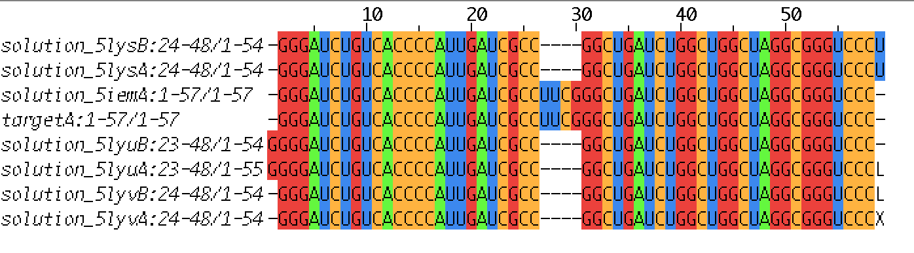

RNA-Puzzle 11
-----------------------------------------------------------------------------

NMR structure of the 5'-terminal hairpin of the 7SK snRNA

Solution sequence vs target sequence:

```
> targetA:1-57
GGGAUCUGUCACCCCAUUGAUCGCCUUCGGGCUGAUCUGGCUGGCUAGGCGGGUCCC
> solution_5iemA:1-57
GGGAUCUGUCACCCCAUUGAUCGCCUUCGGGCUGAUCUGGCUGGCUAGGCGGGUCCC
```

In the PDB there are similar structures for this target.

The target sequence is the same in PDB ID: 5iem, chain A, and this structure is used as the reference for this Puzzle.