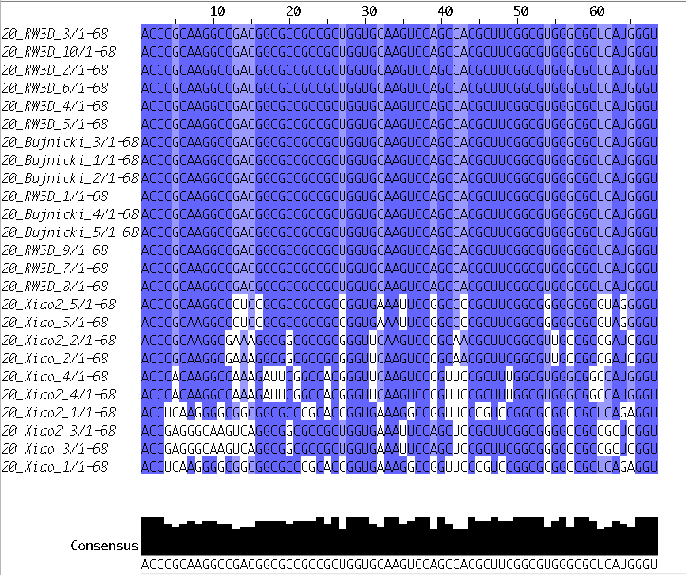

RNA-Puzzle 20
-----------------------------------------------------------------------------

Solution sequence vs target sequence:

    > 21_solution_2 A:1-41
    CCGGACGAGGUGCGCCGUACCCGGUCACGACAAGACGGCGC
    > 21_3dRNA_1_rpr A:1-41
    CCGGACGAGGUGCGCCGUACCCGGUCACGACAAGACGGCGC

Processing:

    rna_pdb_toolsx.py --rpr --inplace --dont_rename_chains *

Twister Sister robozyme

Crystal structure kindly provided by: Amy Ren

Reference: Zheng, L., Mairhofer, E., Teplova, M., Zhang, Y., Ma, J., Patel, D.J., Micura, R., Ren, A. Structure-based insights into self-cleavage by a four-way junctional twister-sister ribozyme. (2017) Nat Commun 8: 1180-1180

PDB id: 5y85 5y87

RMSD:

    [mm] rp20$ git:(master) ✗ rna_calc_rmsd.py -t 20_solution_0.pdb *.pdb
    20_solution_0.pdb          0
    20_Bujnicki_4.pdb          4.71
    20_Bujnicki_1.pdb          5.13
    20_Bujnicki_5.pdb          5.13
    20_Das_2.pdb               5.96
    20_Bujnicki_3.pdb          6.44
    20_Bujnicki_2.pdb          6.77
    20_Das_1.pdb               6.77
    20_RNAComposerHuman_5.pdb  6.86
    20_Das_3.pdb               6.87
    20_Das_4.pdb               9.36
    20_RNAComposer_4.pdb       11.26
    20_RNAComposerHuman_1.pdb  11.85
    20_Xiao3_5.pdb             12.45
    20_RNAComposer_3.pdb       12.9
    20_RNAComposer_5.pdb       12.99
    20_RNAComposerHuman_4.pdb  13.98
    20_RNAComposerHuman_2.pdb  15.34
    20_RW3D_8.pdb              15.93
    20_Das_5.pdb               16.13
    20_RNAComposer_2.pdb       16.19
    20_RW3D_9.pdb              16.24
    20_RW3D_3.pdb              16.3
    20_RW3D_7.pdb              16.41
    20_RW3D_4.pdb              16.51
    20_RNAComposer_1.pdb       16.73
    20_RW3D_10.pdb             16.83
    20_RNAComposerHuman_3.pdb  16.97
    20_RW3D_1.pdb              17.24
    20_RW3D_2.pdb              17.48
    20_Xiao3_1.pdb             17.96
    20_simRNA_1.pdb            18.07
    20_Xiao3_3.pdb             18.54
    20_RW3D_5.pdb              18.57
    20_RW3D_6.pdb              18.86
    20_Xiao3_4.pdb             19.37
    20_Xiao3_2.pdb             19.78
    20_simRNA_4.pdb            20.15
    20_simRNA_5.pdb            20.42
    20_simRNA_3.pdb            22.17

Infs:

    (base) [mx] rp20$ git:(master) ✗ rna_calc_inf.py -t 20_solution_0.pdb *.pdb -pr -sr
    100% (41 of 41) |#####################################################################################################################################################| Elapsed Time: 0:00:02 ETA:  00:00:00csv was created!  inf.csv
                   target                         fn  inf_all  inf_stack  inf_WC  inf_nWC  sns_WC  ppv_WC  sns_nWC  ppv_nWC
    37  20_solution_0.pdb          20_solution_0.pdb     1.00       1.00    1.00     1.00    1.00    1.00     1.00     1.00
    1   20_solution_0.pdb          20_Bujnicki_1.pdb     0.90       0.90    0.96     0.67    0.92    1.00     0.67     0.67
    3   20_solution_0.pdb          20_Bujnicki_2.pdb     0.89       0.88    0.98     0.62    0.96    1.00     0.67     0.57
    6   20_solution_0.pdb          20_Bujnicki_3.pdb     0.88       0.86    0.98     0.61    0.96    1.00     0.50     0.75
    20  20_solution_0.pdb  20_RNAComposerHuman_5.pdb     0.86       0.82    1.00     0.71    1.00    1.00     0.50     1.00
    9   20_solution_0.pdb          20_Bujnicki_4.pdb     0.85       0.85    0.91     0.55    0.88    0.96     0.50     0.60
    10  20_solution_0.pdb               20_Das_3.pdb     0.85       0.82    0.98     0.67    0.96    1.00     0.67     0.67
    0   20_solution_0.pdb          20_Bujnicki_5.pdb     0.85       0.84    0.98     0.41    0.96    1.00     0.33     0.50
    7   20_solution_0.pdb               20_Das_2.pdb     0.85       0.82    0.91     0.83    0.88    0.96     0.83     0.83
    4   20_solution_0.pdb               20_Das_1.pdb     0.85       0.83    0.96     0.67    0.92    1.00     0.67     0.67
    12  20_solution_0.pdb       20_RNAComposer_2.pdb     0.84       0.81    1.00     0.55    1.00    1.00     0.50     0.60
    21  20_solution_0.pdb       20_RNAComposer_5.pdb     0.84       0.82    0.96     0.61    0.92    1.00     0.50     0.75
    5   20_solution_0.pdb               20_Das_5.pdb     0.82       0.80    0.94     0.61    0.88    1.00     0.50     0.75
    19  20_solution_0.pdb       20_RNAComposer_4.pdb     0.82       0.78    0.98     0.61    0.96    1.00     0.50     0.75
    23  20_solution_0.pdb              20_RW3D_3.pdb     0.82       0.79    1.00     0.50    1.00    1.00     0.50     0.50
    24  20_solution_0.pdb              20_RW3D_8.pdb     0.81       0.78    0.96     0.55    0.96    0.96     0.50     0.60
    11  20_solution_0.pdb  20_RNAComposerHuman_2.pdb     0.81       0.76    1.00     0.47    1.00    1.00     0.33     0.67
    15  20_solution_0.pdb       20_RNAComposer_3.pdb     0.81       0.78    0.98     0.41    0.96    1.00     0.33     0.50
    2   20_solution_0.pdb               20_Das_4.pdb     0.80       0.76    0.96     0.61    0.92    1.00     0.50     0.75
    14  20_solution_0.pdb              20_RW3D_1.pdb     0.80       0.78    1.00     0.18    1.00    1.00     0.17     0.20
    35  20_solution_0.pdb              20_RW3D_7.pdb     0.80       0.76    1.00     0.46    1.00    1.00     0.50     0.43
    31  20_solution_0.pdb              20_RW3D_6.pdb     0.80       0.77    1.00     0.33    1.00    1.00     0.33     0.33
    22  20_solution_0.pdb       20_RNAComposer_1.pdb     0.80       0.74    1.00     0.62    1.00    1.00     0.67     0.57
    28  20_solution_0.pdb              20_RW3D_5.pdb     0.79       0.76    1.00     0.33    1.00    1.00     0.33     0.33
    8   20_solution_0.pdb  20_RNAComposerHuman_1.pdb     0.79       0.75    0.92     0.61    0.92    0.92     0.50     0.75
    18  20_solution_0.pdb              20_RW3D_2.pdb     0.79       0.76    1.00     0.33    1.00    1.00     0.33     0.33
    17  20_solution_0.pdb  20_RNAComposerHuman_4.pdb     0.79       0.75    0.92     0.67    0.92    0.92     0.67     0.67
    13  20_solution_0.pdb  20_RNAComposerHuman_3.pdb     0.79       0.76    0.92     0.67    0.92    0.92     0.67     0.67
    25  20_solution_0.pdb              20_RW3D_4.pdb     0.78       0.76    1.00     0.18    1.00    1.00     0.17     0.20
    27  20_solution_0.pdb              20_RW3D_9.pdb     0.78       0.75    1.00     0.18    1.00    1.00     0.17     0.20
    16  20_solution_0.pdb             20_RW3D_10.pdb     0.78       0.74    1.00     0.33    1.00    1.00     0.33     0.33
    30  20_solution_0.pdb             20_Xiao3_4.pdb     0.75       0.77    0.76     0.47    0.58    1.00     0.33     0.67
    33  20_solution_0.pdb             20_Xiao3_5.pdb     0.75       0.77    0.82     0.24    0.67    1.00     0.17     0.33
    32  20_solution_0.pdb             20_Xiao3_2.pdb     0.72       0.76    0.71     0.36    0.50    1.00     0.33     0.40
    26  20_solution_0.pdb             20_Xiao3_3.pdb     0.71       0.74    0.74     0.24    0.54    1.00     0.17     0.33
    29  20_solution_0.pdb             20_Xiao3_1.pdb     0.71       0.70    0.84     0.24    0.71    1.00     0.17     0.33
    39  20_solution_0.pdb            20_simRNA_4.pdb     0.56       0.66    0.38     0.17    0.38    0.39     0.17     0.17
    34  20_solution_0.pdb            20_simRNA_2.pdb     0.54       0.69    0.18     0.00    0.17    0.19     0.00     0.00
    40  20_solution_0.pdb            20_simRNA_5.pdb     0.54       0.69    0.22     0.00    0.21    0.23     0.00     0.00
    36  20_solution_0.pdb            20_simRNA_1.pdb     0.43       0.62    0.00     0.00    0.00    0.00     0.00     0.00
    38  20_solution_0.pdb            20_simRNA_3.pdb     0.42       0.60    0.00     0.00    0.00    0.00     0.00     0.00

Processing:

Problem: Some models contain only one chain, some two chains.

    [mm] rp20$ git:(master) ✗ rna_pdb_toolsx.py --get_seq --compact *.pdb
    # 20_Bujnicki_1
    ACCCGCAAGGCCGACGGCGCCGCCGCUGGUGCAAGUCCAGCCACGCUUCGGCGUGGGCGCUCAUGGGU # A:1-68
    # 20_Bujnicki_2
    ACCCGCAAGGCCGACGGCGCCGCCGCUGGUGCAAGUCCAGCCACGCUUCGGCGUGGGCGCUCAUGGGU # A:1-68
    # 20_Bujnicki_3
    ACCCGCAAGGCCGACGGCGCCGCCGCUGGUGCAAGUCCAGCCACGCUUCGGCGUGGGCGCUCAUGGGU # A:1-68
    # 20_Bujnicki_4
    ACCCGCAAGGCCGACGGCGCCGCCGCUGGUGCAAGUCCAGCCACGCUUCGGCGUGGGCGCUCAUGGGU # A:1-68
    # 20_Bujnicki_5
    ACCCGCAAGGCCGACGGCGCCGCCGCUGGUGCAAGUCCAGCCACGCUUCGGCGUGGGCGCUCAUGGGU # A:1-68
    # 20_Das_1
    ACCCGCAAGGCCGACGGC # A:1-18 GCCGCCGCUGGUGCAAGUCCAGCCACGCUUCGGCGUGGGCGCUCAUGGGU # B:1-50
    # 20_Das_2
    ACCCGCAAGGCCGACGGC # A:1-18 GCCGCCGCUGGUGCAAGUCCAGCCACGCUUCGGCGUGGGCGCUCAUGGGU # B:1-50
    # 20_Das_3
    ACCCGCAAGGCCGACGGC # A:1-18 GCCGCCGCUGGUGCAAGUCCAGCCACGCUUCGGCGUGGGCGCUCAUGGGU # B:1-50
    # 20_Das_4
    ACCCGCAAGGCCGACGGC # A:1-18 GCCGCCGCUGGUGCAAGUCCAGCCACGCUUCGGCGUGGGCGCUCAUGGGU # B:1-50
    # 20_Das_5
    ACCCGCAAGGCCGACGGC # A:1-18 GCCGCCGCUGGUGCAAGUCCAGCCACGCUUCGGCGUGGGCGCUCAUGGGU # B:1-50
    # 20_RNAComposerHuman_1
    ACCCGCAAGGCCGACGGC # A:1-18 GCCGCCGCUGGUGCAAGUCCAGCCACGCUUCGGCGUGGGCGCUCAUGGGU # B:1-50
    # 20_RNAComposerHuman_2
    ACCCGCAAGGCCGACGGC # A:1-18 GCCGCCGCUGGUGCAAGUCCAGCCACGCUUCGGCGUGGGCGCUCAUGGGU # B:1-50
    # 20_RNAComposerHuman_3
    ACCCGCAAGGCCGACGGC # A:1-18 GCCGCCGCUGGUGCAAGUCCAGCCACGCUUCGGCGUGGGCGCUCAUGGGU # B:1-50
    # 20_RNAComposerHuman_4
    ACCCGCAAGGCCGACGGC # A:1-18 GCCGCCGCUGGUGCAAGUCCAGCCACGCUUCGGCGUGGGCGCUCAUGGGU # B:1-50
    # 20_RNAComposerHuman_5
    ACCCGCAAGGCCGACGGC # A:1-18 GCCGCCGCUGGUGCAAGUCCAGCCACGCUUCGGCGUGGGCGCUCAUGGGU # B:1-50
    # 20_RNAComposer_1
    ACCCGCAAGGCCGACGGC # A:1-18 GCCGCCGCUGGUGCAAGUCCAGCCACGCUUCGGCGUGGGCGCUCAUGGGU # B:1-50
    # 20_RNAComposer_2
    ACCCGCAAGGCCGACGGC # A:1-18 GCCGCCGCUGGUGCAAGUCCAGCCACGCUUCGGCGUGGGCGCUCAUGGGU # B:1-50
    # 20_RNAComposer_3
    ACCCGCAAGGCCGACGGC # A:1-18 GCCGCCGCUGGUGCAAGUCCAGCCACGCUUCGGCGUGGGCGCUCAUGGGU # B:1-50
    # 20_RNAComposer_4
    ACCCGCAAGGCCGACGGC # A:1-18 GCCGCCGCUGGUGCAAGUCCAGCCACGCUUCGGCGUGGGCGCUCAUGGGU # B:1-50
    # 20_RNAComposer_5
    ACCCGCAAGGCCGACGGC # A:1-18 GCCGCCGCUGGUGCAAGUCCAGCCACGCUUCGGCGUGGGCGCUCAUGGGU # B:1-50
    # 20_RW3D_1
    ACCCGCAAGGCCGACGGCGCCGCCGCUGGUGCAAGUCCAGCCACGCUUCGGCGUGGGCGCUCAUGGGU # A:1-68
    # 20_RW3D_10
    ACCCGCAAGGCCGACGGCGCCGCCGCUGGUGCAAGUCCAGCCACGCUUCGGCGUGGGCGCUCAUGGGU # A:1-68
    # 20_RW3D_2
    ACCCGCAAGGCCGACGGCGCCGCCGCUGGUGCAAGUCCAGCCACGCUUCGGCGUGGGCGCUCAUGGGU # A:1-68
    # 20_RW3D_3
    ACCCGCAAGGCCGACGGCGCCGCCGCUGGUGCAAGUCCAGCCACGCUUCGGCGUGGGCGCUCAUGGGU # A:1-68
    # 20_RW3D_4
    ACCCGCAAGGCCGACGGCGCCGCCGCUGGUGCAAGUCCAGCCACGCUUCGGCGUGGGCGCUCAUGGGU # A:1-68
    # 20_RW3D_5
    ACCCGCAAGGCCGACGGCGCCGCCGCUGGUGCAAGUCCAGCCACGCUUCGGCGUGGGCGCUCAUGGGU # A:1-68
    # 20_RW3D_6
    ACCCGCAAGGCCGACGGCGCCGCCGCUGGUGCAAGUCCAGCCACGCUUCGGCGUGGGCGCUCAUGGGU # A:1-68
    # 20_RW3D_7
    ACCCGCAAGGCCGACGGCGCCGCCGCUGGUGCAAGUCCAGCCACGCUUCGGCGUGGGCGCUCAUGGGU # A:1-68
    # 20_RW3D_8
    ACCCGCAAGGCCGACGGCGCCGCCGCUGGUGCAAGUCCAGCCACGCUUCGGCGUGGGCGCUCAUGGGU # A:1-68
    # 20_RW3D_9
    ACCCGCAAGGCCGACGGCGCCGCCGCUGGUGCAAGUCCAGCCACGCUUCGGCGUGGGCGCUCAUGGGU # A:1-68
    # 20_Xiao2_1
    ACCUCAAGGGGCGGCGGCGCCCGCACCGGUGAAAGGCCGGUUCCCGUCCGGCGCGGCCGCUCAGAGGU # A:1-68
    # 20_Xiao2_2
    ACCCGCAAGGCGAAAGGCGGCGCCGCGGGUUCAAGUCCCGCAACGCUUCGGCGUUGCCGCCGAUCGGU # A:1-68
    # 20_Xiao2_3
    ACCGAGGGCAAGUCAGGCGGCGCCGCUGGUGAAAUUCCAGCUCCGCUUCGGCGGGGCCGCCGCUCGGU # A:1-68
    # 20_Xiao2_4
    ACCCACAAGGCCAAAGAUUCGGCCACGGGUUCAAGUCCCGUUCCGCUUUGGCGUGGGCGGCCAUGGGU # A:1-68
    # 20_Xiao2_5
    ACCCGCAAGGCCCUCCGCGCCGCCGCCGGUGAAAUUCCGGCCCCGCUUCGGCGGGGGCGCGUAGGGGU # A:1-68
    # 20_Xiao3_1
    ACCCGCAAGGCCGACGGC # A:1-18 GCCGCCGCUGGUGCAAGUCCAGCCACGCUUCGGCGUGGGCGCUCAUGGGU # B:1-50
    # 20_Xiao3_2
    ACCCGCAAGGCCGACGGC # A:1-18 GCCGCCGCUGGUGCAAGUCCAGCCACGCUUCGGCGUGGGCGCUCAUGGGU # B:1-50
    # 20_Xiao3_3
    ACCCGCAAGGCCGACGGC # A:1-18 GCCGCCGCUGGUGCAAGUCCAGCCACGCUUCGGCGUGGGCGCUCAUGGGU # B:1-50
    # 20_Xiao3_4
    ACCCGCAAGGCCGACGGC # A:1-18 GCCGCCGCUGGUGCAAGUCCAGCCACGCUUCGGCGUGGGCGCUCAUGGGU # B:1-50
    # 20_Xiao3_5
    ACCCGCAAGGCCGACGGC # A:1-18 GCCGCCGCUGGUGCAAGUCCAGCCACGCUUCGGCGUGGGCGCUCAUGGGU # B:1-50
    # 20_Xiao_1
    ACCUCAAGGGGCGGCGGCGCCCGCACCGGUGAAAGGCCGGUUCCCGUCCGGCGCGGCCGCUCAGAGGU # A:1-68
    # 20_Xiao_2
    ACCCGCAAGGCGAAAGGCGGCGCCGCGGGUUCAAGUCCCGCAACGCUUCGGCGUUGCCGCCGAUCGGU # A:1-68
    # 20_Xiao_3
    ACCGAGGGCAAGUCAGGCGGCGCCGCUGGUGAAAUUCCAGCUCCGCUUCGGCGGGGCCGCCGCUCGGU # A:1-68
    # 20_Xiao_4
    ACCCACAAGGCCAAAGAUUCGGCCACGGGUUCAAGUCCCGUUCCGCUUUGGCGUGGGCGGCCAUGGGU # A:1-68
    # 20_Xiao_5
    ACCCGCAAGGCCCUCCGCGCCGCCGCCGGUGAAAUUCCGGCCCCGCUUCGGCGGGGGCGCGUAGGGGU # A:1-68
    # 20_simRNA_1
    ACCCGCAAGGCCGACGGC # A:1-18 GCCGCCGCUGGUGCAAGUCCAGCCACGCUUCGGCGUGGGCGCUCAUGGGU # B:1-50
    # 20_simRNA_2
    ACCCGCAAGGCCGACGGC # A:1-18 GCCGCCGCUGGUGCAAGUCCAGCCACGCUUCGGCGUGGGCGCUCAUGGGU # B:1-50
    # 20_simRNA_3
    ACCCGCAAGGCCGACGGC # A:1-18 GCCGCCGCUGGUGCAAGUCCAGCCACGCUUCGGCGUGGGCGCUCAUGGGU # B:1-50
    # 20_simRNA_4
    ACCCGCAAGGCCGACGGC # A:1-18 GCCGCCGCUGGUGCAAGUCCAGCCACGCUUCGGCGUGGGCGCUCAUGGGU # B:1-50
    # 20_simRNA_5
    ACCCGCAAGGCCGACGGC # A:1-18 GCCGCCGCUGGUGCAAGUCCAGCCACGCUUCGGCGUGGGCGCUCAUGGGU # B:1-50
    # 20_solution_0
    ACCCGCAAGGCCGACGGC # A:1-18 GCCGCCGCUGGUGCAAGUCCAGCCACGCUUCGGCGUGGGCGCUCAUGGGU # B:1-50

Thus single-chain structures were processed with:

    rna_pdb_toolsx.py --edit 'A:19-68>B:1-50' --inplace <single chain models>

However, there are still structures from Xioa with some unidentified sequences:

Fig. Sequence alignments of sequences taken from structures, now moved to `misc-seqs-Xiao`.

    [mm] rna_pdb_toolsx.py --get_seq --compact *.pdb  --oneline
    ACCCGCAAGGCCGACGGCGCCGCCGCUGGUGCAAGUCCAGCCACGCUUCGGCGUGGGCGCUCAUGGGU # A:1-68 # 20_Bujnicki_1
    ACCCGCAAGGCCGACGGCGCCGCCGCUGGUGCAAGUCCAGCCACGCUUCGGCGUGGGCGCUCAUGGGU # A:1-68 # 20_Bujnicki_2
    ACCCGCAAGGCCGACGGCGCCGCCGCUGGUGCAAGUCCAGCCACGCUUCGGCGUGGGCGCUCAUGGGU # A:1-68 # 20_Bujnicki_3
    ACCCGCAAGGCCGACGGCGCCGCCGCUGGUGCAAGUCCAGCCACGCUUCGGCGUGGGCGCUCAUGGGU # A:1-68 # 20_Bujnicki_4
    ACCCGCAAGGCCGACGGCGCCGCCGCUGGUGCAAGUCCAGCCACGCUUCGGCGUGGGCGCUCAUGGGU # A:1-68 # 20_Bujnicki_5
    ACCCGCAAGGCCGACGGCGCCGCCGCUGGUGCAAGUCCAGCCACGCUUCGGCGUGGGCGCUCAUGGGU # A:1-68 # 20_RW3D_1
    ACCCGCAAGGCCGACGGCGCCGCCGCUGGUGCAAGUCCAGCCACGCUUCGGCGUGGGCGCUCAUGGGU # A:1-68 # 20_RW3D_10
    ACCCGCAAGGCCGACGGCGCCGCCGCUGGUGCAAGUCCAGCCACGCUUCGGCGUGGGCGCUCAUGGGU # A:1-68 # 20_RW3D_2
    ACCCGCAAGGCCGACGGCGCCGCCGCUGGUGCAAGUCCAGCCACGCUUCGGCGUGGGCGCUCAUGGGU # A:1-68 # 20_RW3D_3
    ACCCGCAAGGCCGACGGCGCCGCCGCUGGUGCAAGUCCAGCCACGCUUCGGCGUGGGCGCUCAUGGGU # A:1-68 # 20_RW3D_4
    ACCCGCAAGGCCGACGGCGCCGCCGCUGGUGCAAGUCCAGCCACGCUUCGGCGUGGGCGCUCAUGGGU # A:1-68 # 20_RW3D_5
    ACCCGCAAGGCCGACGGCGCCGCCGCUGGUGCAAGUCCAGCCACGCUUCGGCGUGGGCGCUCAUGGGU # A:1-68 # 20_RW3D_6
    ACCCGCAAGGCCGACGGCGCCGCCGCUGGUGCAAGUCCAGCCACGCUUCGGCGUGGGCGCUCAUGGGU # A:1-68 # 20_RW3D_7
    ACCCGCAAGGCCGACGGCGCCGCCGCUGGUGCAAGUCCAGCCACGCUUCGGCGUGGGCGCUCAUGGGU # A:1-68 # 20_RW3D_8
    ACCCGCAAGGCCGACGGCGCCGCCGCUGGUGCAAGUCCAGCCACGCUUCGGCGUGGGCGCUCAUGGGU # A:1-68 # 20_RW3D_9
    ACCUCAAGGGGCGGCGGCGCCCGCACCGGUGAAAGGCCGGUUCCCGUCCGGCGCGGCCGCUCAGAGGU # A:1-68 # 20_Xiao2_1
    ACCCGCAAGGCGAAAGGCGGCGCCGCGGGUUCAAGUCCCGCAACGCUUCGGCGUUGCCGCCGAUCGGU # A:1-68 # 20_Xiao2_2
    ACCGAGGGCAAGUCAGGCGGCGCCGCUGGUGAAAUUCCAGCUCCGCUUCGGCGGGGCCGCCGCUCGGU # A:1-68 # 20_Xiao2_3
    ACCCACAAGGCCAAAGAUUCGGCCACGGGUUCAAGUCCCGUUCCGCUUUGGCGUGGGCGGCCAUGGGU # A:1-68 # 20_Xiao2_4
    ACCCGCAAGGCCCUCCGCGCCGCCGCCGGUGAAAUUCCGGCCCCGCUUCGGCGGGGGCGCGUAGGGGU # A:1-68 # 20_Xiao2_5
    ACCUCAAGGGGCGGCGGCGCCCGCACCGGUGAAAGGCCGGUUCCCGUCCGGCGCGGCCGCUCAGAGGU # A:1-68 # 20_Xiao_1
    ACCCGCAAGGCGAAAGGCGGCGCCGCGGGUUCAAGUCCCGCAACGCUUCGGCGUUGCCGCCGAUCGGU # A:1-68 # 20_Xiao_2
    ACCGAGGGCAAGUCAGGCGGCGCCGCUGGUGAAAUUCCAGCUCCGCUUCGGCGGGGCCGCCGCUCGGU # A:1-68 # 20_Xiao_3
    ACCCACAAGGCCAAAGAUUCGGCCACGGGUUCAAGUCCCGUUCCGCUUUGGCGUGGGCGGCCAUGGGU # A:1-68 # 20_Xiao_4
    ACCCGCAAGGCCCUCCGCGCCGCCGCCGGUGAAAUUCCGGCCCCGCUUCGGCGGGGGCGCGUAGGGGU # A:1-68 # 20_Xiao_5
